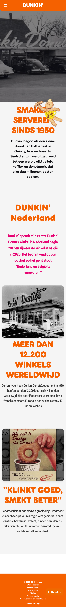

# Procesverslag
Markdown is een simpele manier om HTML te schrijven.  
Markdown cheat cheet: [Hulp bij het schrijven van Markdown](https://github.com/adam-p/markdown-here/wiki/Markdown-Cheatsheet).

Nb. De standaardstructuur en de spartaanse opmaak van de README.md zijn helemaal prima. Het gaat om de inhoud van je procesverslag. Besteedt de tijd voor pracht en praal aan je website.

Nb. Door *open* toe te voegen aan een *details* element kun je deze standaard open zetten. Fijn om dat steeds voor de relevante stuk(ken) te doen.

## Jij

  
uitwerken voor kick-off werkgroep

  ### Auteur:
  Tin phna

  #### Je startniveau:
  rood

  #### Je focus:
  responsive

## Je website

  
uitwerken voor kick-off werkgroep

  ### Je opdracht:
  link naar de website die je gaat namaken óf de naam/omschrijving van je eigen ontwerp
  https://www.dunkin.nl/nl/

  #### Screenshot(s) van de eerste pagina (small screen): 
  hier de naam van de pagina: HomePage 
  
  

  #### Screenshot(s) van de tweede pagina (small screen):
  hier de naam van de pagina: About us pagina 
  
 

## Toegankelijkheidstest 1/2 (week 1)

  
uitwerken na test in 2e werkgroep

  ### Bevindingen
  Lijst met je bevindingen die in de test naar voren kwamen:
  1. Veel tekstjes waren in kopjes gezet terwijl het als 
 voorgelezen moet worden met de screenreader
  2. Pagina's missen een <h1>
  3. hierarchie met de h2,h3 is er niet. 
  4. responsive, knopjes overlappen stukken tekst in de navigatie 
  5. afbeeldingen zijn niet mooi geplaatst wanneer de scherm kleiner wordt
  6. x
  7. x
  

## Breakdownschets (week 1)

  
uitwerken na afloop 3e werkgroep

  ### de hele pagina: 
  

  ### dynamisch deel (bijv menu): 
  

  ### wellicht nog een dynamisch deel (bijv filter): 
  

## Voortgang 1 (week 2)

  
uitwerken voor 1e voortgang

  ### Stand van zaken
  hier dit ging goed & dit was lastig (neem ook screenshots op van delen van je website en code)

  ### Agenda voor meeting
  samen met je groepje opstellen

  | Tin Phan     | student 2          | student 3    | student 4        |
  | ---             | ---                | ---          | ---              |
  | css             | en dit             | en ik dit    | en dan ik dat    |
  | html            | dit als er tijd is | nog een punt | dit wil ik zeker |
  | breakdownschets | ...                | ...          | ...              |

  ### Verslag van meeting
  hier na afloop snel de uitkomsten van de meeting vastleggen
  1. Ik mis een h1 op de pagina.
  2. footer breakdown ontbreekt.
  3. Product items zijn geen articles, maar een list item.
  4. Als je een afbeelding in een article wilt afsnijden kan je overflow gebruiken zodat de img niet uit de container steekt en op hoogte blijft met de container. 

-mijn plan van aanpak, ik ga nu de hmtl opnieuw schrijven en de navigatie eerst fixen zodat het responsief is met mobiele schermen en kleinere schermformaten. Wanneer ik klaar ben met de navigatie ga ik verder met de main. 

## Voortgang 2 (week 3)

  
uitwerken voor 2e voortgang

  ### Stand van zaken
  - ik wil kijken of mijn navigatie responsief klopt in de css.
  - meer duidelijkheid krijgen over @fontface en hoe ik de fonts kan vinden die in de website worden gebruikt. 

  ### Agenda voor meeting
  samen met je groepje opstellen

  | Tin      | aminata        | student 3    | student 4        |
  | ---            | ---                | ---          | ---              |
  | dit bespreken  | en dit             | en ik dit    | en dan ik dat    |
  | en dat ook nog | dit als er tijd is | nog een punt | dit wil ik zeker |
  | duidelijkheid over html          | de correcte manier om iets responsief te maken.             | ...          | ...              |

  ### Verslag van meeting
  hier na afloop snel de uitkomsten van de meeting vastleggen
  - Tijdens de voortgang gesprek kwam ik erachter dat mijn responsieve navigatie omgekeerd is. Ik moet eerst css gaan schrijven voor een klein scherm, vervolgens kan ik met @media min width de navigatie balk responsief maken.
  - De @fontface, klopt niet 100%.  zoals je kan zien in deze screenshot klopt niet, font weight is de dikte de belangrijkste waardes van font weight is 400(normal) en 700(bold). Check css mozilla om de @fontface goed te gebruiken. 

## Toegankelijkheidstest 2/2 (week 4)

  
uitwerken na test in 9e werkgroep

  ### Bevindingen
  Lijst met je bevindingen die in de test naar voren kwamen (geef ook aan wat er verbeterd is):

## Voortgang 3 (week 4)

  
uitwerken voor 3e voortgang

  ### Stand van zaken
  hier dit ging goed & dit was lastig (neem ook screenshots op van delen van je website en code)

  ### Agenda voor meeting
  samen met je groepje opstellen

  | student 1      | student 2          | student 3    | student 4        |
  | ---            | ---                | ---          | ---              |
  | dit bespreken  | en dit             | en ik dit    | en dan ik dat    |
  | en dat ook nog | dit als er tijd is | nog een punt | dit wil ik zeker |
  | ...            | ...                | ...          | ...              |

  ### Verslag van meeting
  hier na afloop snel de uitkomsten van de meeting vastleggen

  - punt 1
  - punt 2
  - nog een punt
  - ...

## Eindgesprek (week 5)

  
uitwerken voor eindgesprek

  ### Je uitkomst - karakteristiek screenshots:
  

  ### Dit ging goed/Heb ik geleerd: 
  Korte omschrijving met plaatjes

  

  ### Dit was lastig/Is niet gelukt:
  Korte omschrijving met plaatjes

  

## Bronnenlijst

  
continu bijhouden terwijl je werkt

  Nb. Wees specifiek ('css-tricks' als bron is bijv. niet specifiek genoeg). 
  Nb. ChatGpT en andere AI horen er ook bij.
  Nb. Vermeld de bronnen ook in je code.

  1. bron 1
  2. bron 2
  3. ...

